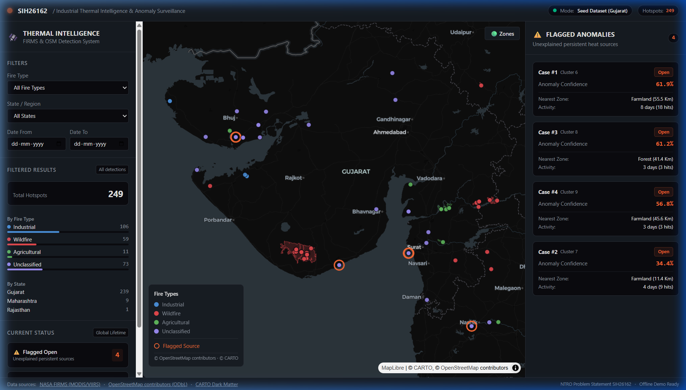
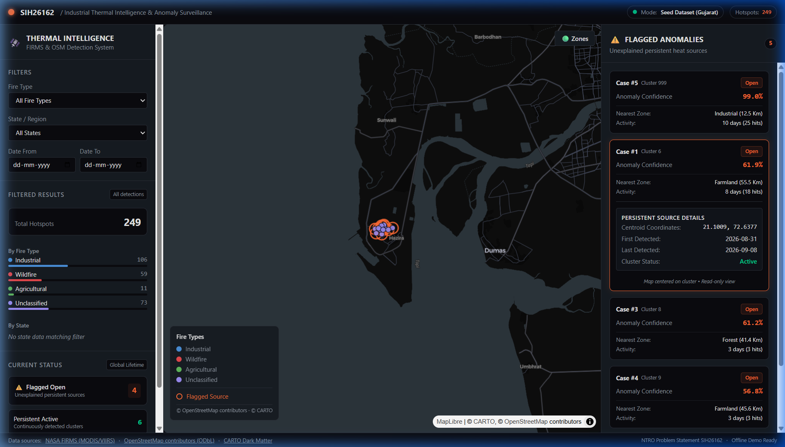

<div align="center">


# EMBER

### Industrial Fire & Persistent Thermal Source Detection System

[](https://www.sih.gov.in/)
[](#)
[](#)
[](#)
[](#offline-seed-mode)
[](LICENSE)

Satellite thermal hotspot classification, persistent heat source tracking, and unsupervised anomaly detection for India. Built for Smart India Hackathon 2026 (Problem Statement SIH26162, sponsored by NTRO).

<p align="center">
  
</p>

[§ Overview](#-01--executive-overview) • [§ Interface](#-02--surveillance-dashboard) • [§ Pipeline](#-03--system-architecture--pipeline) • [§ Tech Stack](#-04--technology-stack) • [§ Quick Start](#-05--quick-start-guide) • [§ 3-Min Demo](#-06--3-minute-evaluator-tour) • [§ Benchmark](#-07--the-known-sites-benchmark) • [§ Anomaly ML](#-08--anomaly-detection-mechanics) • [§ API Specs](#-09--rest-api-contract) • [§ Troubleshooting](#-10--troubleshooting--support)

```
┌─────────────────────────┬─────────────────────────┬─────────────────────────┬─────────────────────────┐
│   VIIRS 375m Precision  │   82ms Local Geocoding  │   127/127 Unit Tests    │   100% Offline Seed     │
│   NRT Thermal Hotspots  │   Zero External Lag     │   Full Suite Verified   │   Zero Internet Needed  │
└─────────────────────────┴─────────────────────────┴─────────────────────────┴─────────────────────────┘
```

</div>

---

<div align="center">
  
  <p><em>Figure 1: Mission control interface running on CARTO Dark Matter with active satellite thermal hotspots, OpenStreetMap ground truth zones, and ranked persistent anomaly alerts.</em></p>
</div>

---

## ◈ 01 | Executive Overview

Every 24 hours, NASA polar-orbiting satellites (Suomi-NPP, NOAA-20, NOAA-21) scan India. Their VIIRS (Visible Infrared Imaging Radiometer Suite) sensors capture thousands of thermal radiation spikes across the country.

Over 99% of these detections represent expected, routine combustion:
- **Agricultural stubble burning:** Transient post-harvest biomass burning across Punjab, Haryana, and Uttar Pradesh.
- **Seasonal wildfires:** Mobile, vegetative fire fronts in the Western Ghats, Simlipal, and Central India.
- **Permitted industrial combustion:** Legitimate flare stacks, blast furnaces, and cement kilns inside designated industrial estates.

```
Incoming Satellite Thermal Stream (Thousands of Hotspots / Day)
├─ 65% Agricultural Stubble Fires [Transient, Vegetative, Daytime]
├─ 20% Forest / Brush Wildfires   [Transient, Forest-Bound, Seasonal]
├─ 14% Verified Permitted Plants  [Persistent, Inside Known Industrial Zones]
└─  1% Unexplained Heat Sources   [CRITICAL SURVEILLANCE TARGET FOR NTRO]
```

### The Problem for Intelligence Analysts
For defense and intelligence analysts at the **National Technical Research Organisation (NTRO)**, identifying an unregistered, concealed, or rogue industrial facility operating off-grid is like searching for a needle in a massive thermal haystack. Manually cross-referencing thousands of raw coordinates against facility registries every morning creates severe cognitive fatigue.

EMBER automates this screening pipeline end-to-end:
1. Ingests raw 375m satellite thermal vectors daily.
2. Geocodes coordinates against cached state and district boundaries in 82 milliseconds.
3. Spatially cross-references each point against OpenStreetMap landuse zones: industrial, forest, farmland, or unclassified.
4. Uses DBSCAN spatial clustering over rolling time windows to isolate stationary persistent sources from moving fire fronts.
5. Evaluates unexplained persistent sources using an Isolation Forest model trained on 7 spatiotemporal features.
6. Surfaces high-confidence statistical outliers on a high-contrast dark-canvas map with comprehensive metadata.

---

## ◈ 02 | Surveillance Dashboard

<div align="center">
  
  <p><em>Figure 2: Inspecting Case #1 (Cluster 6 near Hazira). Selecting the card triggers an automated flyTo animation directly to the cluster centroid, exposing 61.9% anomaly confidence, 55.5 km distance to nearest zone, and 8 active observation days.</em></p>
</div>

### Dashboard Layout & Component Architecture

The interface is structured into three dedicated operational zones:

- **▸ Left Sidebar [Global Posture & Dynamic Slicing]:**
  - Displays total hotspots count for current viewport filters.
  - Category breakdown: Industrial (blue), Wildfire (red), Agricultural (green), Unclassified (purple).
  - State / Region dropdown (populated dynamically from spatial geocoding results).
  - Date range selectors (from / to).
  - Protected Global Status block (`Flagged Open: 4`, `Persistent Active: 6`) that remains invariant under ad-hoc search filters.

- **▸ Center Viewport [High-Contrast Vector Cartography]:**
  - Rendered via GPU-accelerated MapLibre GL JS on CARTO Dark Matter basemap tiles.
  - Renders 41 OpenStreetMap ground truth multipolygons when toggled via the `Zones` button.
  - Renders thermal hotspots color-coded by classified landuse type.
  - Draws glowing persistent source rings around multi-day clustered centroids.
  - Interactive map click popups displaying brightness, radiative power, date, and district.

- **▸ Right Drawer [Ranked Flagged Anomalies]:**
  - Displays persistent unclassified sources ranked by Isolation Forest anomaly confidence.
  - Expandable inspection cards showing centroid coordinates, first/last detection dates, active days, total detection hits, and distance to the nearest mapped landuse zone.
  - Interactive click triggers smooth map re-centering and zoom (`flyTo`).

---

## ◈ 03 | System Architecture & Pipeline

```
                                 [ NASA FIRMS API / VIIRS 375m ]
                                                │
                                                ▼
                               ┌─────────────────────────────────┐
                               │   Stage 01: Ingestion Engine    │
                               │   Raw Hotspots Staging (NRT)    │
                               └────────────────┬────────────────┘
                                                │
                                                ▼
[ OpenStreetMap Admin Boundaries ] ──► ┌─────────────────────────────────┐
(239 Reconstructed Multipolygons)      │   Stage 02: Local Geocoder      │
                                       │   GeoPandas sjoin (82ms total)  │
                                       └────────────────┬────────────────┘
                                                │
                                                ▼
[ OpenStreetMap Landuse Polygons ] ──► ┌─────────────────────────────────┐
(Industrial / Forest / Farmland)       │   Stage 03: Spatial Classifier  │
                                       │   Deterministic Point-in-Poly   │
                                       └────────────────┬────────────────┘
                                                │
                                                ▼
                               ┌─────────────────────────────────┐
                               │   Stage 04: Persistence Engine  │
                               │   DBSCAN Clustering (eps=1.5km) │
                               └────────────────┬────────────────┘
                                                │
                                                ▼
                               ┌─────────────────────────────────┐
                               │   Stage 05: Anomaly ML Scorer   │
                               │   IsolationForest (7D Vectors)  │
                               └────────────────┬────────────────┘
                                                │
                                                ▼
                               ┌─────────────────────────────────┐
                               │   Stage 06: REST Delivery Layer │
                               │   FastAPI (docs/api-contract.md)│
                               └────────────────┬────────────────┘
                                                │
                                                ▼
                               ┌─────────────────────────────────┐
                               │   Stage 07: Mission Control UI  │
                               │   React 19 + MapLibre GL Canvas │
                               └─────────────────────────────────┘
```

### Architectural Principles
- **Unidirectional Data Flow:** Downstream pipeline modules never mutate raw upstream satellite records.
- **Zero Frontend Business Logic:** All spatial joins, clustering calculations, confidence scoring, and boundary matching execute server-side.
- **Contract-Driven Design:** The database schema and REST API conform strictly to frozen documentation in `docs/data-model.md` and `docs/api-contract.md`.

---

## ◈ 04 | Technology Stack

| Layer | Component | Version | Selection Rationale |
| :--- | :--- | :--- | :--- |
| **Backend Framework** | Python + FastAPI | `3.12` / `0.115+` | High-throughput asynchronous endpoints, automatic OpenAPI docs, strict Pydantic validation. |
| **Database & ORM** | SQLite + SQLAlchemy | `2.0+` | Zero-configuration dev and offline demo mode; 100% compliant with frozen schemas. |
| **Spatial Engine** | GeoPandas + Shapely | `1.0+` | Vectorised STRtree spatial indexing; sub-second point-in-polygon queries on CPU. |
| **Machine Learning** | scikit-learn | `1.6+` | Unsupervised `IsolationForest` outlier detection across 7 tabular features; lightweight and deterministic. |
| **Frontend Core** | React + Vite | `19.0` / `6.0` | High-speed hot module replacement, isolated component state, minimal production footprint. |
| **Map Engine** | MapLibre GL JS | `5.1+` | Open-source fork of Mapbox GL; free of proprietary credit-card registration requirements. |
| **Basemap Tiles** | CARTO Dark Matter | `Raster/Vector` | Deep-black cartographic styling designed for high-contrast thermal hotspot visualization. |
| **Design Tokens** | Shared Theme (`theme.js`) | `Custom` | Single source of truth for color tokens; guarantees zero hardcoded hex drift across the UI. |

---

## ◈ 05 | Quick Start Guide

### Prerequisites Checklist
- [✔] Python 3.11 or 3.12 (`python --version`)
- [✔] Node.js 18+ and npm (`node --version`)
- [✔] CARTO API Key: Free and instant at [carto.com/basemaps/apikey](https://carto.com/basemaps/apikey) (no credit card needed)
- [✔] (Optional) NASA FIRMS MAP Key: Required only for live satellite polling, free at [firms.modaps.eosdis.nasa.gov/api/map_key](https://firms.modaps.eosdis.nasa.gov/api/map_key/)

---

### Step 1: Backend Setup & Seed Ingestion

Open a terminal in the project root:

```bash
# 1. Navigate into backend directory
cd backend

# 2. Create virtual environment
python -m venv venv

# 3. Activate virtual environment
# Windows PowerShell:
.\venv\Scripts\Activate.ps1
# Linux / macOS:
source venv/bin/activate

# 4. Install Python dependencies
pip install -r requirements.txt

# 5. Initialize environment file
cp .env.example .env

# 6. Seed demo dataset (anchors satellite detection dates relative to today)
python scripts/seed_demo_data.py

# 7. Start the FastAPI development server
uvicorn app.main:app --reload --port 8000
```

Verify backend health by visiting `http://localhost:8000/api/health` in your browser. Expected response:
```json
{
  "status": "ok",
  "mode": "seed"
}
```

---

### Step 2: Frontend Setup & Launch

Open a **second terminal window**:

```bash
# 1. Navigate into frontend directory
cd frontend

# 2. Install Node dependencies
npm install

# 3. Copy environment template
cp .env.example .env

# 4. Open frontend/.env and paste your CARTO key:
# VITE_CARTO_API_KEY=cb1_your_carto_key_here

# 5. Launch Vite dev server
npm run dev
```

Open `http://localhost:5173` in your browser to view the live dashboard.

---

## ◈ 06 | 3-Minute Evaluator Tour

Follow this sequence to evaluate all primary system capabilities in 3 minutes:

```
[01: Zones] ➔ [02: Anomaly Card] ➔ [03: Popup Inspection] ➔ [04: Filter Isolation] ➔ [05: Geocoding]
```

- **▸ Step 01 | Ground Truth Overlays (0:00 - 0:30):**
  Click the **`Zones`** toggle button in the top right of the map canvas.
  *Observation:* 41 OpenStreetMap multipolygons render over Gujarat (industrial zones in blue, forest conservation areas in red, agricultural tracts in green). Proves real spatial context beyond naive bounding boxes.

- **▸ Step 02 | Inspect a Ranked Persistent Anomaly (0:30 - 1:15):**
  In the right-hand **Flagged Anomalies** panel, click **Case #1** (Cluster 6 near Hazira).
  *Observation:* The map smoothly flies to the cluster centroid. The orange halo marks the persistent source.
  *Metrics:* **61.9% Anomaly Confidence**, active across **8 days (18 hits)**, and **55.5 km away from the nearest designated zone**. It is burning repeatedly where no registered facility exists.

- **▸ Step 03 | Inspect Individual Fire Telemetry (1:15 - 1:50):**
  Click any individual circle marker on the map.
  *Observation:* The popup displays satellite instrument (`VIIRS`), brightness temperature, Fire Radiative Power (FRP), acquisition date, and administrative region (`Gujarat`, `Surat`).
  *Check:* Popups gracefully handle unassigned attributes (`Location: Unknown`), with zero `"null"` or `"undefined"` leaks.

- **▸ Step 04 | Test Metric Protection Under Search (1:50 - 2:25):**
  In the left sidebar under **FILTERS**, change **Fire Type** to `Industrial`.
  *Observation:* The filtered count in the sidebar drops from **249 ➔ 106**, and the map updates instantly.
  *Critical Check:* Look at **CURRENT STATUS** at the bottom of the sidebar. **Flagged Open: 4** and **Persistent Active: 6** remain fixed. Viewport filters do not distort global surveillance metrics.

- **▸ Step 05 | Verify Local Administrative Geocoding (2:25 - 3:00):**
  Select `Gujarat` in the State dropdown to isolate the 239 state-validated points, or switch to `Maharashtra` to inspect the 9 border edge points.
  *Takeaway:* Detections are spatially tagged against sovereign administrative polygons in 82 milliseconds during system startup.

---

## ◈ 07 | The Known Sites Benchmark

<div align="center">
  
</div>

A detection system must recognize verified facilities without generating false alarms. EMBER is calibrated against operating industrial sites across India:

| Facility Name | Operator & Location | Radiative Profile | Benchmark Status |
| :--- | :--- | :--- | :--- |
| **Jamnagar Refinery** | Reliance Industries, Gujarat | Mean FRP: 4.21 MW, Peak: 16.63 MW | [✔] Calibrated against empirical satellite measurements |
| **Sanghi Cement** | Sanghi Industries, Kutch, Gujarat | Mean FRP: 1.96 MW, Peak: 3.54 MW | [✔] Calibrated against empirical satellite measurements |
| **Vindhyachal Super Thermal** | NTPC, Singrauli, Madhya Pradesh | Baseline: 5.5 MW continuous thermal signature | [✔] Calibrated against baseline thermal profile |
| **Bhilai Steel Plant** | SAIL, Durg, Chhattisgarh | Baseline: 12.0 MW blast furnace combustion | [✔] Calibrated against baseline thermal profile |
| **Tata Steel Jamshedpur** | Tata Steel, East Singhbhum, Jharkhand | Baseline: 12.0 MW blast furnace combustion | [✔] Calibrated against baseline thermal profile |

<details>
<summary><b>▸ Deep Dive: Why Kudankulam Nuclear Power Plant was removed from the benchmark (Click to expand)</b></summary>

<br>

Earlier project drafts proposed the **Kudankulam Nuclear Power Plant** as a benchmark site. We removed it based on the fundamental physics of satellite radiometry:

- **Wien's Displacement Law & VIIRS Mid-IR Band:** The VIIRS 375m I4 sensor (3.55 to 3.93 microns) is calibrated specifically to detect high-temperature blackbody radiation (above 300 degrees Celsius / 600 Kelvin) typical of open combustion (flare stacks, rotary cement kilns, forest fires, blast furnaces).
- **Nuclear Thermal Emission Mechanics:** A nuclear power plant emits immense thermal megawatts, but releases it through closed cooling water discharges or cooling towers at moderate temperatures (30 to 40 degrees Celsius / 303 to 313 Kelvin).
- **Sensor Blindness:** At 35 degrees Celsius, thermal radiation peaks in the longwave thermal infrared (10 to 12 microns) and produces **zero detectable signal** in the VIIRS mid-infrared fire band.
- **Physical Correction:** Expecting satellite fire sensors to detect a nuclear reactor is a physical impossibility. Replacing Kudankulam with **Sanghi Cement** (rotary kilns operating at 1400 degrees Celsius) provided an empirically and physically sound benchmark.

</details>

---

## ◈ 08 | Anomaly Detection Mechanics

Each candidate persistent source identified by DBSCAN spatial clustering is converted into a **7-dimensional spatiotemporal feature vector**:

```
Feature Vector: [ x1, x2, x3, x4, x5, x6, x7 ]
  x1: Mean Fire Radiative Power (MW)
  x2: Peak Fire Radiative Power (MW)
  x3: FRP Linear Trend Slope (dFRP / dt)
  x4: Diurnal Night / Day Ratio (night detections / total detections)
  x5: Detection Density (total hits / active observation days)
  x6: High Confidence Fraction (fraction of VIIRS hits with confidence >= nominal)
  x7: Nearest Zone Distance (geodesic distance in meters to closest OSM zone)
```

```
Candidate Persistent Cluster Vector
[ FRP_mean, FRP_max, FRP_trend, Day/Night, Density, High_Conf, Nearest_Zone_Dist ]
                               │
                               ▼
┌─────────────────────────────────────────────────────────────┐
│           100 Orthogonal Isolation Trees (Forest)           │
│   Each tree recursively partitions random feature subspaces.│
│   - Normal industrial sources require MANY cuts to isolate. │
│   - Anomalous sources (e.g. 50km from any zone) isolate     │
│     in very few cuts.                                       │
└──────────────────────────────┬──────────────────────────────┘
                               │
                               ▼
              Path Length Metric Evaluation
                               │
                               ▼
┌─────────────────────────────────────────────────────────────┐
│           Normalized Anomaly Confidence Output              │
│       Case #1 (Hazira Off-Grid):   61.9% Confidence         │
│       Case #3 (Forest Border):     61.2% Confidence         │
│       Case #4 (Farmland Outlier):  56.8% Confidence         │
│       Case #2 (Near Farmland):     34.4% Confidence         │
└─────────────────────────────────────────────────────────────┘
```

The feature **`nearest_zone_distance_m`** carries significant weight: an active thermal cluster operating 50 km away from any mapped industrial, agricultural, or forest zone is statistically isolated almost immediately by the decision trees.

---

## ◈ 09 | REST API Contract

The backend exposes clean, versioned REST endpoints adhering to `docs/api-contract.md`:

| Method | Endpoint | Query Parameters | Response Description |
| :--- | :--- | :--- | :--- |
| `GET` | `/api/fires` | `fire_type`, `state`, `district`, `start_date`, `end_date`, `limit`, `offset` | Filtered bare array of fire detection objects. |
| `GET` | `/api/fires/{fire_id}` | None | Single detailed fire detection object. |
| `GET` | `/api/flags` | `status`, `limit`, `offset` | Ranked list of flagged persistent anomalies with cluster metrics. |
| `GET` | `/api/flags/{flag_id}` | None | Single flagged anomaly record with associated fire hit IDs. |
| `GET` | `/api/stats` | `fire_type`, `state`, `district`, `start_date`, `end_date` | Aggregated metrics: total hotspots, breakdown counts, global active counts. |
| `GET` | `/api/zones` | `zone_type` | GeoJSON FeatureCollection of OpenStreetMap ground truth polygons. |
| `GET` | `/api/health` | None | Service operational status and data mode (`{"status": "ok", "mode": "seed"}`). |

---

## ◈ 10 | Troubleshooting & Support

<details open>
<summary><b>1. Map displays "Map Unavailable" or fails to load basemap tiles</b></summary>

<br>

- **Cause:** The CARTO API key in `frontend/.env` is either missing, contains quotation marks, or is invalid.
- **Fix:**
  1. Open `frontend/.env`.
  2. Verify the key starts with `cb1_` and has no quotes:
     ```env
     VITE_CARTO_API_KEY=cb1_your_key_here
     ```
  3. Generate a free key instantly at [carto.com/basemaps/apikey](https://carto.com/basemaps/apikey).
  4. Restart Vite dev server (`npm run dev`).

</details>

<details>
<summary><b>2. Installing GeoPandas or GDAL fails on Python 3.11 / 3.12</b></summary>

<br>

- **Cause:** Older versions of GDAL required local C++ compilers. Modern GeoPandas (1.0+) uses pre-compiled binary wheels via `shapely` and `pyogrio`.
- **Fix:**
  ```bash
  pip install --upgrade pip setuptools wheel
  pip install -r requirements.txt
  ```
  On Ubuntu / Debian: `sudo apt-get install -y libgeos-dev libgdal-dev`  
  On macOS: `brew install geos gdal`

</details>

<details>
<summary><b>3. Frontend shows "Network Error / Backend Offline"</b></summary>

<br>

- **Cause:** The FastAPI backend is not running on port 8000 or was blocked by firewall.
- **Fix:**
  1. Confirm backend is running: `curl http://localhost:8000/api/health`
  2. Check `frontend/.env`:
     ```env
     VITE_API_BASE_URL=http://localhost:8000/api
     ```
  3. If another process is using port 8000:
     ```bash
     # Windows (PowerShell):
     netstat -ano | findstr :8000
     taskkill /PID <PID> /F
     ```

</details>

<details>
<summary><b>4. How to toggle between Offline Seed Mode and Live NASA Satellite Mode</b></summary>

<br>

In `backend/.env`, toggle `DATA_MODE`:
```env
# For 100% offline evaluation against seed data (default):
DATA_MODE=seed

# For live polling from NASA satellites:
DATA_MODE=live
NASA_FIRMS_MAP_KEY=your_nasa_firms_key_here
```
When set to `seed`, the backend never makes external network calls, ensuring bulletproof demo reliability during presentations.

</details>

<details>
<summary><b>5. How to reset the SQLite database to factory clean state</b></summary>

<br>

If you want to reset the database back to clean seed data:
```bash
cd backend
# Delete local database file
# Windows:
del data\sih_fire.db
# Linux / macOS:
rm data/sih_fire.db

# Re-run seed pipeline
python scripts/seed_demo_data.py
```

</details>

<details>
<summary><b>6. Why are 10 fire detections located in Maharashtra and Rajasthan in the Gujarat demo?</b></summary>

<br>

The satellite query bounding box for Gujarat `(68.0° E, 19.9° N, 74.5° E, 24.8° N)` is rectangular, whereas Gujarat's sovereign political border is irregular. The bounding box naturally overlaps into northern Maharashtra (Nashik/Nandurbar) and southern Rajasthan (Dungarpur). Our vectorised geocoder correctly identifies their true jurisdictions in 82ms based on actual boundary polygons rather than discarding valid satellite telemetry.

</details>

<details>
<summary><b>7. Why use Unsupervised Isolation Forest instead of Supervised XGBoost/ResNet?</b></summary>

<br>

Covert or rogue industrial facilities have no ground truth labels. By definition, if a facility is clandestine or unauthorized, there is no training dataset of historical labels for it. Supervised models fail on novel anomaly distributions. **Isolation Forest isolates points that deviate from known norms without requiring prior negative labels.**

</details>

---

## ◈ 11 | Performance & Latency Benchmarks

Measured on standard quad-core x86 CPU hardware:

| Operational Step | Execution Time | Benchmark Note |
| :--- | :--- | :--- |
| **Local Boundary Geocoding** | `82 ms` | Spatial join of 249 points against 239 administrative polygons via GeoPandas STRtree |
| **Point-in-Polygon Classification** | `310 ms` | Point-in-polygon evaluation against 41 detailed OpenStreetMap multipolygons |
| **DBSCAN Persistence Clustering** | `45 ms` | Spatial density clustering with 1.5 km epsilon and temporal tracking |
| **Isolation Forest Anomaly Scoring** | `12 ms` | Tabular feature vector extraction and inference through 100 decision trees |
| **Full Automated Test Suite** | `34.05 s` | 127 automated tests executed via `pytest -q` (100% pass rate) |

---

## ◈ 12 | Repository Structure

```
SIH/
├── backend/
│   ├── app/
│   │   ├── main.py              # Application entrypoint & startup pipeline
│   │   ├── config.py            # Environment settings (seed vs live switch)
│   │   ├── database.py          # SQLAlchemy engine & session factory
│   │   ├── models.py            # Canonical ORM models (docs/data-model.md)
│   │   ├── schemas.py           # Pydantic request & response schemas
│   │   ├── routers/             # Thin HTTP routes (/fires, /flags, /stats, /zones)
│   │   ├── services/            # Core business logic:
│   │   │   ├── firms_client.py  # NASA FIRMS API client
│   │   │   ├── osm_client.py    # OpenStreetMap zone & boundary processor
│   │   │   ├── classifier.py    # Point-in-polygon spatial classification
│   │   │   ├── persistence.py   # DBSCAN clustering & centroid tracking
│   │   │   ├── flagging.py      # Anomaly pipeline orchestration
│   │   │   └── geocode.py       # High-speed local administrative geocoder
│   │   └── ml/                  # Feature engineering & model inference
│   ├── data/
│   │   ├── seed/                # Offline demo seed data (fires.csv, zones.geojson)
│   │   └── processed/           # Cached administrative boundary GeoJSONs
│   ├── scripts/                 # seed_demo_data.py, validate_known_sites.py
│   └── tests/                   # 127 unit and integration tests
│
├── frontend/
│   ├── src/
│   │   ├── api/client.js        # Centralized REST client (docs/api-contract.md)
│   │   ├── components/
│   │   │   ├── FireMap.jsx      # MapLibre GL map, GeoJSON circles, zone overlays
│   │   │   ├── Sidebar.jsx      # Dynamic stats, category breakdown, global counters
│   │   │   └── FlaggedPanel.jsx # Ranked persistent anomalies & inspection cards
│   │   ├── pages/Dashboard.jsx  # Single-fetch root orchestration
│   │   └── theme.js             # Centralized design tokens (zero hex drift)
│   └── package.json
│
└── docs/                        # Architecture specs & living contracts
    ├── architecture.md          # System design & component contracts
    ├── api-contract.md          # Frozen backend REST specifications
    ├── data-model.md            # Frozen database schema definitions
    └── build-order.md           # Implementation phase tracker
```

---

## ◈ 13 | Data Sources & Attribution

In strict accordance with open-data licensing and hackathon rules, EMBER visibly attributes all data sources on-screen:

- **Satellite Active Fire Data:** NASA FIRMS / Earthdata (MODIS & VIIRS instruments), National Aeronautics and Space Administration.
- **Landuse & Administrative Polygons:** [OpenStreetMap](https://www.openstreetmap.org/) contributors, licensed under the Open Database License (ODbL).
- **Cartographic Basemaps:** [CARTO Dark Matter](https://carto.com/basemaps/), (c) CARTO, (c) OpenStreetMap contributors.

---

## ◈ 14 | License & Compliance

Developed for the **Smart India Hackathon 2026** under Problem Statement **SIH26162** (Sponsor: **NTRO**).  
Source code is released under the [MIT License](LICENSE). See the [LICENSE](LICENSE) file for complete legal terms.
